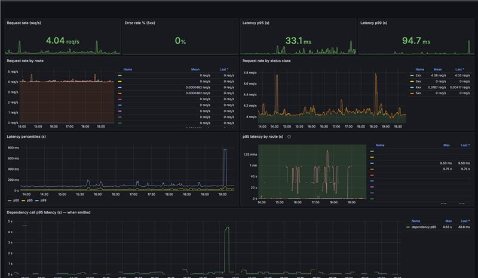

# Grafana dashboards

Importable dashboards for the Prometheus series emitted by `fastapi-vitals`.

## Import

1. Grafana → **Dashboards** → **New** → **Import**.
2. Upload [`fastapi-vitals-overview.json`](fastapi-vitals-overview.json).
3. Select your Prometheus datasource when prompted.

Template variables:

| Variable | Purpose | Default |
|----------|---------|---------|
| `datasource` | Prometheus datasource | first Prometheus |
| `service` | `service` label (`SERVICE` env) | `.*` |
| `env` | `env` label (`ENV` env) | `.*` |

## OpenMetrics / exemplars

Scrape `/metrics` as **OpenMetrics** (`metrics_response()`), not classic
Prometheus text. Classic exposition drops histogram exemplars, so
metrics→trace click-through will not work even if Tempo is wired.

## Screenshot

Production-shaped overview (maintainer deployment):

